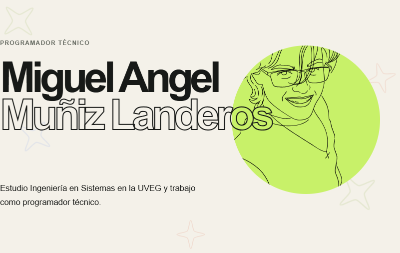

<div align="center">
  <a href="https://www.neokey.dev">
    
  </a>

  <h1>Miguel Angel Muñiz Landeros</h1>
  <p><strong>Programador técnico · Estudiante de Ingeniería en Sistemas Computacionales</strong></p>

  <p>
    <a href="https://www.neokey.dev"></a>
    <a href="https://www.linkedin.com/in/neokey/"></a>
    <a href="https://www.instagram.com/neokeeyyy/"></a>
  </p>
</div>

<p align="center">
  <a href="https://www.neokey.dev">
    
  </a>
</p>

<p align="center">
  <a href="https://www.neokey.dev"><strong>Ver presentación completa en neokey.dev →</strong></a>
</p>

<br>

## Hola, soy Miguel 👋

Tengo 18 años, soy de **Ojuelos de Jalisco** y me gusta convertir problemas cotidianos en herramientas útiles. Trabajo como **programador técnico en el sector gasero**, donde desarrollo soluciones a medida para las necesidades de cada proyecto.

Actualmente estudio la **Licenciatura en Ingeniería en Sistemas Computacionales en la UVEG**. Mi formación comenzó como **Técnico Programador en el CBTis 245**, con una base avalada por el IPN y la UNAM.

> Si lo puedes imaginar, lo puedes programar.

## En qué estoy trabajando

- 🧰 Automatización y mejoras para flujos de trabajo en **SIRETRAC**.
- 🌐 Experiencias web cuidadas, accesibles y con una identidad visual propia.
- 📱 Exploración de desarrollo Android con **Kotlin** y **Material Design 3**.
- 📚 Construcción constante de fundamentos mientras curso Ingeniería en Sistemas.

<details>
  <summary><strong>Conoce más sobre mi formación</strong></summary>

  <br>

  <table>
    <tr>
      <td><strong>CBTis 245</strong><br>Técnico Programador</td>
      <td><strong>UVEG</strong><br>Ingeniería en Sistemas Computacionales · En curso</td>
    </tr>
  </table>
</details>

## Tecnologías con las que construyo

<p>
  
  
  
  
  
  
  
</p>

## Proyectos destacados

<table>
  <tr>
    <td width="50%" valign="top">
      <h3><a href="https://github.com/neokeeyyy/Easytrac-userscripts">EasyTRAC</a></h3>
      <p>Conjunto de userscripts para agilizar el uso de SIRETRAC por permisionarios y simplificar tareas frecuentes de la plataforma.</p>
      <p><code>JavaScript</code> <code>Userscripts</code> <code>Tampermonkey</code></p>
    </td>
    <td width="50%" valign="top">
      <h3><a href="https://github.com/neokeeyyy/BetterTune">BetterTune</a></h3>
      <p>Adaptación de OpenTune para Android con Material Design 3 y una experiencia personalizada para reproducir YouTube Music.</p>
      <p><code>Kotlin</code> <code>Android</code> <code>Material Design 3</code></p>
    </td>
  </tr>
  <tr>
    <td width="50%" valign="top">
      <h3><a href="https://github.com/neokeeyyy/easytrac-modules">easytrac-modules</a></h3>
      <p>Módulos JavaScript reutilizables para extender y mantener las herramientas del ecosistema EasyTRAC.</p>
      <p><code>JavaScript</code></p>
    </td>
    <td width="50%" valign="top">
      <h3><a href="https://www.neokey.dev">neokey.dev</a></h3>
      <p>Mi portafolio personal: una experiencia web estática para presentar mi historia, formación, proyectos y formas de contacto.</p>
      <p><code>HTML</code> <code>CSS</code> <code>JavaScript</code></p>
    </td>
  </tr>
</table>

## Mi recorrido

```text
CBTis 245  ──►  Técnico Programador
                  │
                  ▼
Sector gasero ──► Programador técnico · Herramientas a medida
                  │
                  ▼
UVEG       ──►  Ingeniería en Sistemas Computacionales · En curso
```

## Conecta conmigo

¿Tienes una idea, una herramienta que te gustaría mejorar o una oportunidad interesante?

<div align="center">
  <a href="https://www.neokey.dev"><strong>Visita mi portafolio →</strong></a>
  ·
  <a href="https://www.linkedin.com/in/neokey/">LinkedIn</a>
  ·
  <a href="https://www.instagram.com/neokeeyyy/">Instagram</a>
</div>

<br>

<div align="center">
  <sub>Hecho con curiosidad desde Ojuelos de Jalisco · <a href="https://www.neokey.dev">neokey.dev</a></sub>
</div>
